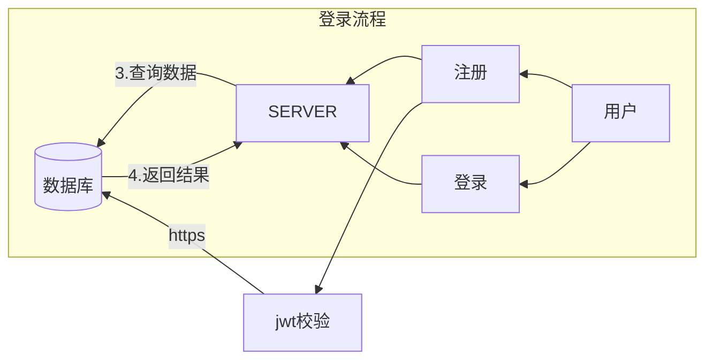

# Python3中不同数据结构的创建方式

==Python== ==dict== ==字符串== ==list==

## 1. 字符串的3中创建方式

- 单引号`'''` 创建字符串

```python
a = 'I am a student'
print(a)
```

- 双引号`""`创建字符串

```python
a = "I am a student"
print(a)
```

- 连续3个单引号`'''`或者3个单引号，创建多行字符串

```python
c = '''
I am a student
My name is Alice
I am a teacher
My name is Bob
'''
print(c)
```

<details>
<summary><font style="font-size: initial;color: bisque">output</font> </summary>

```plantuml
I am a student
I am a student

I am a student
My name is Alice
I am a teacher
My name is Bob
```

</details>

---

## 2. 列表的五种创建方式

- 用`[]`创建列表

```python
a = [1, 2, 3]
print(a)
```

- 用`list`创建列表

```python
b = list('abc')
print(b)
c = list('hello,workd')
print(c)
d = list({"aa": 1, "bb": 2})  ##对于字典，生成的是key列表。
print(d)
```

- 用`range`创建整数列表

```python
e = list(range(10))
print(e)
```

- 用列表推导式创建列表

```python
f = [i for i in range(4)]
print(f)
```

- 用`list`和`[]`创建空列表

```python
g = list()
print(g, type(g))
h = []
print(h, type(h))
```

<details>
<summary><font style="font-size: initial;color: bisque">output</font> </summary>

```plantuml
[1, 2, 3]
['a', 'b', 'c']
['h', 'e', 'l', 'l', 'o', ',', 'w', 'o', 'r', 'k', 'd']
['aa', 'bb']
[0, 1, 2, 3, 4, 5, 6, 7, 8, 9]
[0, 1, 2, 3]
[] <class 'list'>
[] <class 'list'>
```

</details>

---

## 3. 字典的五种创建方式

- 用`{}`创建字典

```python
a = {'name': 'xiao fang', 'age': 18, 'jon': 'teacher'}
b = {'name': '小李', 'age': 15, 'jon': 'sudden'}
print(f"{a}\n{b}")
```

- 用`dict`创建字典

```python
c1 = dict(name="小丽", job="12号技师")
c2 = dict(name="小王", job="18号技师")
print(f"{c1}\n{c2}")
```

- 用`zip()`函数创建字典

```python
x1 = ['name', 'age', 'job']
x2 = ['娟娟', '25', '14号技师']
x3 = dict(zip(x1, x2))
print(x3)
```

- 用`{}`和`dict`创建空字典

```python
f1 = {}
f2 = dict()
print(f"{f1},{type(f1)}\n{f2},{type(f2)}")
```

- 用`fromkeys`创建`值为空`的字典

```python
h = dict.fromkeys(['name', 'age', 'jobs'])
print(f"{h},{type(h)}")
```

<details>
<summary><font style="font-size: initial;color: bisque">output</font> </summary>

```plantuml
{'name': 'xiao fang', 'age': 18, 'jon': 'teacher'}
{'name': '小李', 'age': 15, 'jon': 'sudden'}
{'name': '小丽', 'job': '12号技师'}
{'name': '小王', 'job': '18号技师'}
{'name': '娟娟', 'age': '25', 'job': '14号技师'}
{},<class 'dict'>
{},<class 'dict'>
{'name': None, 'age': None, 'jobs': None},<class 'dict'>
```

</details>


